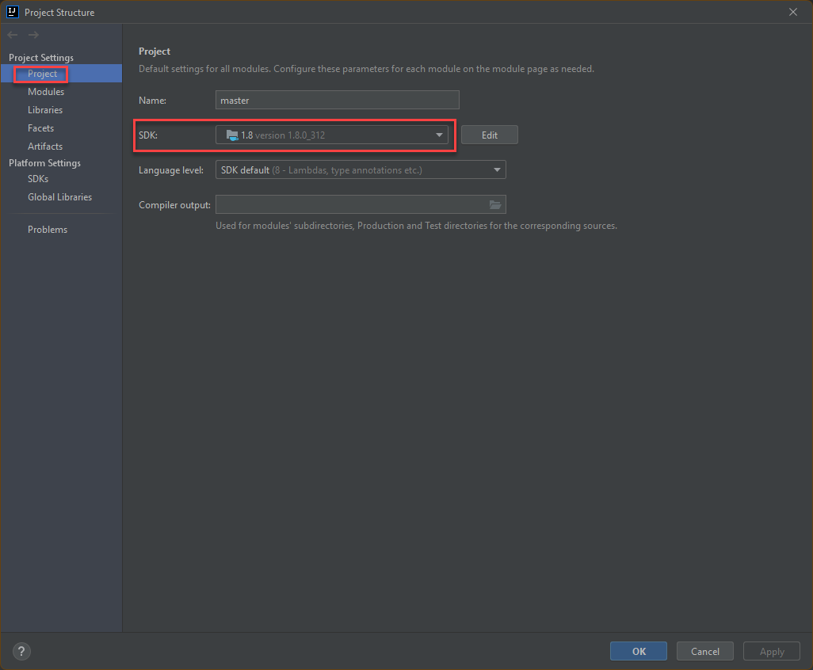

# Automation Test Guideline

Behavioural Driven Development **(BDD)** automation framework using Java, Selenium, Cucumber, TestNG, Maven, PhantomJS

## Tools and Technologies Used
1. Language: Java (OpenJDK)
2. Automation Tool: Selenium
2. Testing Framework: TestNG
3. BDD Approach: Cucumber
4. Built Tool: Maven
5. Logging: Log4J
6. Headless Browser: PhantomJS
7. Reporting: [Cucumber Reporting](https://github.com/damianszczepanik/cucumber-reporting)
6. Follows "Page Object Model"
7. Employs "Page Factory"
8. Supports multiple browsers and no need to download drivers manually

## Features of Framework
1. BDD framework using Cucumber. Feature files can be written easily using Given, When, Then etc.
2. Browser (Chrome/Firefox) can be configured at run time from command line (or Continuous Integration tool, if configured).
3. Tests can run in headless browser (PhantomJS) by passing a parameter at run time.
4. Screenshot would be taken if any scenario failed and saved under **screenshots" folder.
5. HTML report gets generated after each test run and can be found /target/cucumber-html-report/index.html

## Project Structure

**folder: conf** : Configuration and settings

**folder: docs** : Documentation include guideline, coding convention, etc.

**folder: drivers** : It has exe of chromedriver and phantomjs. This is required while creating the webdriver session.

**folder: logs** : Runtime logs

**folder: screenshots** : Scenario failed screenshots

**folder: test-data** : Test data and input

**folder: test-reports** : Test reports

**folder: test-results** : Test results and all the output files will be stored here (screenshots/csv/txt files)

**package: com..selenium.core** : It includes the common classes (and methods) which are required by each test to perform actions. Below are classes in this package:

**package: com..selenium.features** : It contains all different features (tests) files.

**package: com..selenium.pages** : It has web elements corresponding to the specific page which is used by corressponding logic classes.

**package: com..selenium.tests** : It contains all the classes where actions and assertions happens.

**package: com..selenium.utils** : It contains Log.java class which contains methods to show the logs on console and save the logs in LogFile.txt of each run.

**Assertion.java** : It contains assertion methods like verifyEquals,screenshot etc. These can be used in any of the helper files to verify the actual result with expected result.

**BasePage.java** : It is a common repository for all the web driver methods which are used in every class present under logic package to perform actions like click, findElement etc. Every new method which is being used in logic classes should be added in this class as well. It is to reduce the duplicate code. Each page class extends this class.

**BaseTest.java** : It is a common test step definitions.

**CreateSession.java** : All the methods to create a new session and destroy the session after the test(s) execution is over.

**TestRunner.java** : Features/tests to be executed are defined in this class. Other test configurations are also defined here.

## Test Report ##

Once test execution is completed, go to test-reports/cucumber-report folder and open feature-overview.html file

You can see the test results at different level

# Setting Up Project

## Installing necessary tools

1) Download and install JDK at: https://www.oracle.com/java/technologies/downloads/ , then configuring Java HOME PATH to installed JDK
   

2) Clone automation source by using either **SourceTree** or **GitExtensions** for your convenience, steps are as below:

    2.1) Source Tree, download and install SourceTree to clone github project at: https://www.sourcetreeapp.com/

   - Create ssh private/public keys to authenticate with Github, open Powershell as administrator``ssh key-gen``
   - Keep all things default as suggestion, keys will be generated by default at: "C:\Users\\<user\>\\.ssh"
   - Add private ssh key to SourceTree at: Tool > Options > SSH Client Configuration > OpenSSH
   - Add public key into Github Account: ... > Account Settings > SSH and GPG keys
   - Clone automation project by using ssh: ...

    2.2) GitExtensions, download and install GitExtensions at: http://gitextensions.github.io/
   - Create authenticate token here: https://github.com/settings/tokens with appropriate permissions
        
   - Add token into gitExtensions:
     
   - Clone automation project:
     
   

3) Install IntelliJ IDEA Community version (or Eclipse as optional IDE) at: https://www.jetbrains.com/idea/download/#section=windows
4) On IntellJ IDEA, set JDK version at: File > Project Structure... > Project > SDK version
   
5) Open just cloned automation project on IntellJ IDEA with type **Maven**, wait for all dependencies to finish downloading
   
6) Install cucumber plugin on IntelliJ IDEA. Open File > Setting > Plugins > type cucumber and install
   
7) Right-click on the project and build. Make sure no failures in build result.
   

## Test Execution
Every cucumber test case MUST have a tag name, for e.g. @MYT-001
   
To run all available test cases (all tags) in automation project, execute following command (by default browser would be chrome):

**$ ./mvnw clean test**

To run test with configurable browser (for firefox, use -Dbrowser=firefox) , available driver setup : chrome/firefox

**$ ./mvnw clean test -Dbrowser=chrome**

To run tests headlessly (this mode is used for executing test in background - not open web browser, used for CI/CD execution mode)

**$ ./mvnw clean test -Dheadless=yes**

To run specific scenario:

**$ ./mvnw clean test -Dcucumber.filter.tags="@<tag_name>"**

To run multiple mentioned scenarios:

**$ ./mvnw clean test -Dcucumber.filter.tags="@<tag_name_1> or @<tag_name_2>"**
